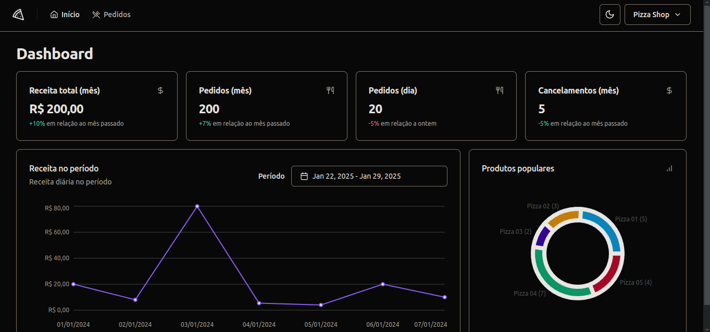
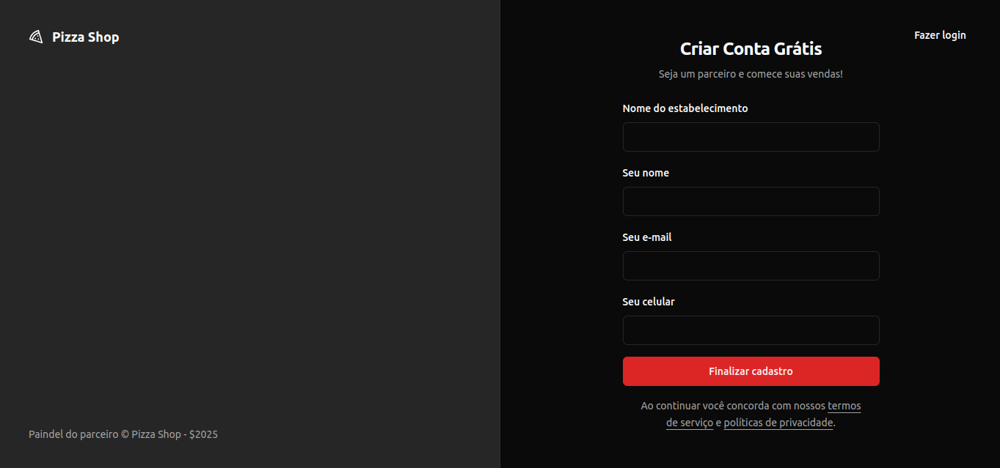
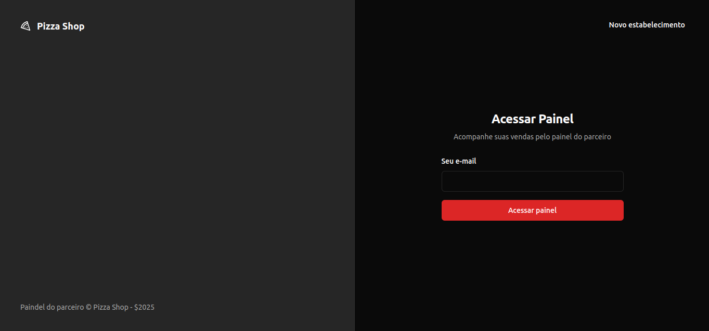
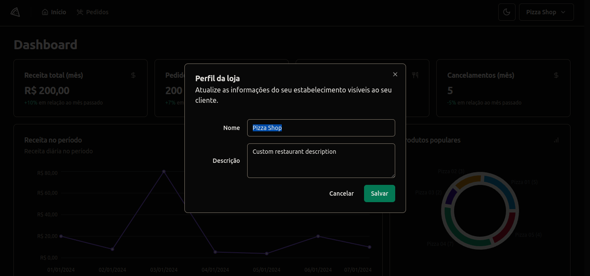
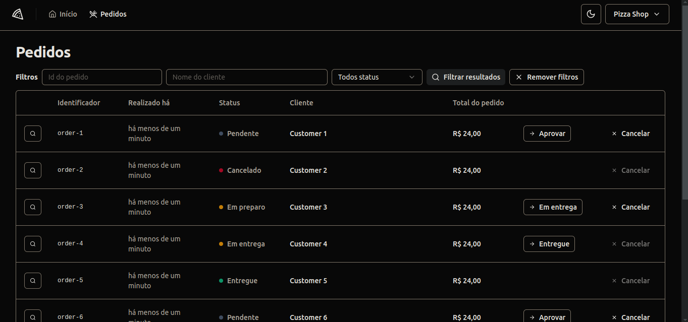
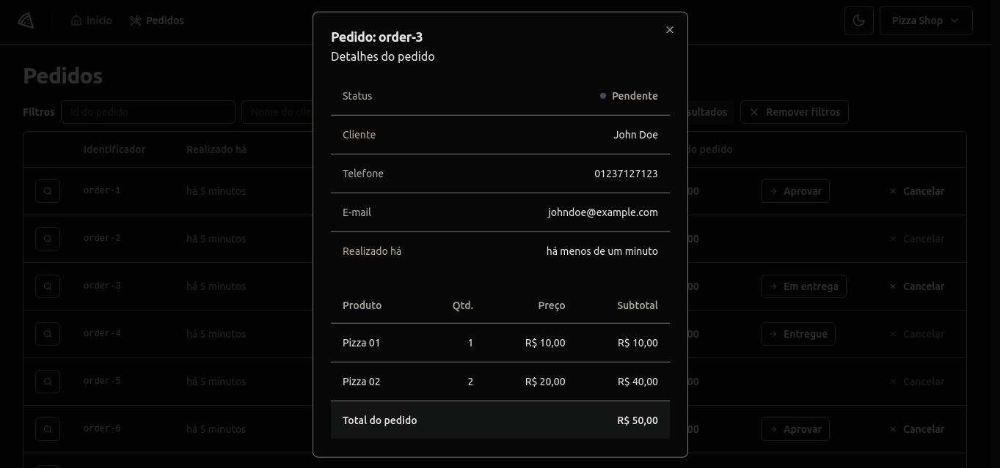

<!-- CABEÇALHO -->

    <h1>
        🍕 Pizza Shop 🍕
    </h1>
    

        <a href="#%EF%B8%8F-sobre-o-projeto">Sobre o Projeto</a> •
        <a href="#-funcionalidades">Funcionalidades</a> •
        <a href="#-layout">Layout</a> •
        <a href="#%EF%B8%8F-tecnologias">Tecnologias</a> •
        <a href="#-autor">Autor</a>
    

<!-- SOBRE O PROJETO -->

## 🖥️ Sobre o Projeto

        

 

> Projeto desenvolvido durante módulo **Integrando Frontend-Backend** da Formação de React.js da [Rocketseat](https://www.rocketseat.com.br/).

Esse projeto consiste em uma aplicação de um sistema de gerenciamento de uma pizzaria.

O objetivo consistia em criar uma aplicação frontend completa fazendo conexão com o backend por meio de uma API, com testes unitários e teste e2e.

<!-- FUNCIONALIDADES -->

## 💡 Funcionalidades

- [x] Fazer login
- [x] Fazer logout
- [x] Cadastrar restaurante
- [x] Editar informações do restaurante
- [x] Listar pedidos
- [x] Filtrar pedidos
- [x] Exibir detalhes do pedido
- [x] Atualizar status do pedido
- [x] Exibir métricas do restaurante

<!-- LAYOUT -->

## 🎨 Layout

  
  
  
  
  

<!-- TECNOLOGIAS -->

## 🛠️ Tecnologias

Para o desenvolvimento desse projeto, as seguintes ferramentas foram utilizadas:

- **[Vite](https://vitejs.dev/)**
- **[React.js](https://pt-br.reactjs.org/)**
- **[TypeScript](https://www.typescriptlang.org/)**
- **[Tailwind CSS](https://tailwindcss.com/)**
- **[React Router DOM](https://reactrouter.com/)**
- **[React Hook Form](https://react-hook-form.com/)**
- **[Zod](https://zod.dev/)**
- **[React Query](https://tanstack.com/query)**
- **[Axios](https://axios-http.com/)**
- **[Shadcn UI](https://ui.shadcn.com/)**
- **[Recharts](https://recharts.org/en-US/)**
- **[Vitest](https://vitest.dev/)**
- **[Playwright](https://playwright.dev/)**

<!-- AUTOR -->

## 👨‍💻 Autor

Marcos Kenji Kuribayashi

 

---

Desenvolvido por Marcos Kenji Kuribayashi 😉
